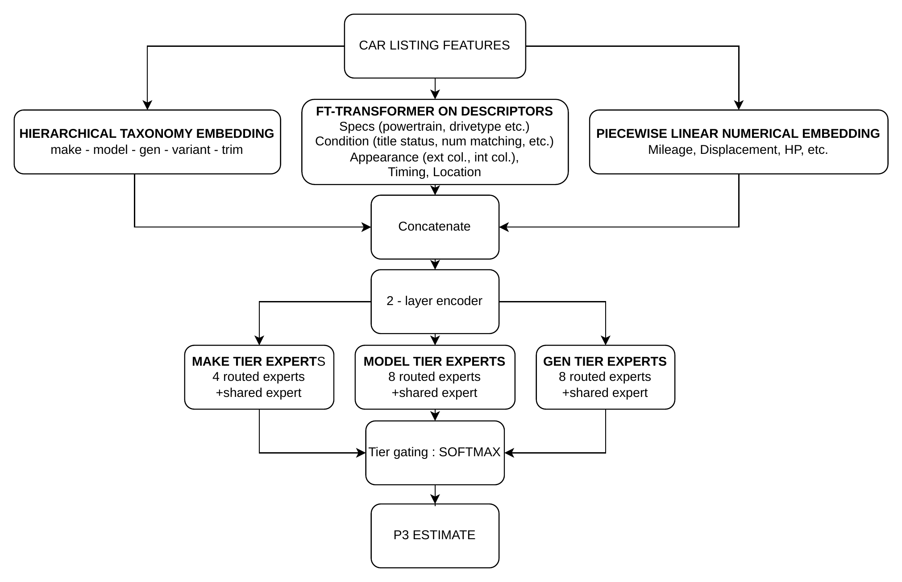

# P3 — Attention-Based Model

**Attention-Based Model.** We train a supervised hierarchical mixture-of-experts model on 157,265 listings, with 6,026 held out for validation. We retain a separate pool of listings for testing that none of the models is ever exposed to. The architecture combines three complementary representations of each listing. First, a hierarchical taxonomy embedding capturing vehicle identity (`make`, `model`, `generation`, `variant`, and `trim`). This is important because certain models' generations and rare variants and trims inherit useful signal from their better-known make and model, so the model still produces informed predictions for cars with little training data of their own. Second, an FT-Transformer (Gorishniy et al., 2021) encoding vehicle specification, condition and provenance, appearance, and market timing and location. Attention layers capture cross-feature interactions among the categorical descriptors — for example, how conservation grade combined with body style and transmission jointly influence price in ways no single feature does alone. Third, a piecewise-linear numerical embedding (Gorishniy et al., 2022) for vehicle usage and engine characteristics. Because these continuous inputs span vastly different scales a single linear projection would waste capacity normalizing them; learnable piecewise-linear knots let each feature define its own nonlinear mapping to the shared embedding space. The three representations are concatenated, passed through a two-layer encoder, and routed to three soft mixture-of-experts tiers at the `make`, `model`, and `generation` levels. Routing to taxonomy-level experts allows the model to learn pricing patterns specific to, say, Porsche 911s that differ systematically from the broader market, while sharing structure across makes through the tier-gate. A final tier-gate produces a softmax-weighted prediction over the three tiers. Training optimizes a Huber loss on log price with load-balance and router *z*-loss terms.

<p align="center">
  
</p>

## Architecture summary

| Component | Detail | Why this choice |
|---|---|---|
| Hierarchical taxonomy embedding | `make`, `model`, `generation`, `variant`, `trim` | Rare variants and trims inherit signal from their better-known make and model — handles the long tail of vehicle taxonomy |
| FT-Transformer over descriptors (Gorishniy et al., 2021) | 19 categorical descriptors (specification, condition, appearance, timing, location) plus 7 boolean flag tokens | Attention captures cross-feature interactions among descriptors that a flat MLP would miss (e.g. conservation × body style × transmission) |
| Piecewise-linear numerical embedding (Gorishniy et al., 2022) | 5 continuous features (`age_at_listing`, `log_mileage`, `miles_per_year`, `engine_displacement_L`, `engine_hp`) | Learnable knots let each feature define its own nonlinear mapping; needed for wide-scale inputs such as log-mileage and depreciation curves |
| Two-layer encoder | Applied after concatenation of the three streams | Mixes information across the three input streams — the first layer where taxonomy IDs, descriptor attention output, and numerical embeddings can interact, producing the joint representation that downstream tier routers gate on |
| Mixture-of-experts tiers | Three soft tiers: `make`, `model`, `generation` | Routes each listing's pricing pattern to taxonomy-specific experts (e.g. Porsche 911s priced separately from the broader market) |
| Routed experts per tier | 4 (`make`), 8 (`model`), 8 (`generation`) | Finer tiers warrant more experts: more distinct generations than makes in the auction market |
| Shared expert per tier | One always-on, in addition to the routed experts | Provides a baseline prediction when routed experts are uncertain — graceful degradation for sparse routes |
| Tier-gate | Softmax over the three tier outputs | Softmax produces a differentiable convex combination of the tier predictions: gradients flow back through the gate so it co-trains with the experts, and the final prediction stays bounded inside the convex hull of the three tier outputs |
| Training loss | Huber on log price | Listing prices are strongly right-skewed (mean \$41,354 > median \$26,250, SD \$43,221, max \$300k); the log transform brings the target close to symmetric, and Huber bounds the per-sample gradient contribution from any single residual so the long right tail does not dominate updates |
| Auxiliary regularization | Load-balance term, router *z*-loss | Load-balance prevents single-expert dominance (a standard MoE failure mode); *z*-loss penalizes large pre-softmax router logits |

## Which tier dominates the prediction

For every car the tier-gate emits a softmax over `make`, `model`, and `generation`. The tier with the largest weight is the dominant contributor for that prediction. The pattern is consistent on training data and on the held-out test set:

| Dominant tier | Training set (n = 138,984) | Test set (n = 300) |
|---|---|---|
| Generation | 59.5% | 56.7% |
| Model | 40.1% | 43.0% |
| Make | 0.4% | 0.3% |

The generation tier dominates a majority of predictions, the model tier the rest, and the make tier essentially never dominates a single car — instead, it contributes a steady ~25% baseline weight (mean weight ≈ 0.25, never exceeding ~0.37 for any car).

## References

```bibtex
@inproceedings{gorishniy2021revisiting,
  author    = {Gorishniy, Yury and Rubachev, Ivan and Khrulkov, Valentin and Babenko, Artem},
  title     = {Revisiting Deep Learning Models for Tabular Data},
  booktitle = {Advances in Neural Information Processing Systems},
  volume    = {34},
  pages     = {18932--18943},
  year      = {2021}
}

@inproceedings{gorishniy2022embeddings,
  author    = {Gorishniy, Yury and Rubachev, Ivan and Babenko, Artem},
  title     = {On Embeddings for Numerical Features in Tabular Deep Learning},
  booktitle = {Advances in Neural Information Processing Systems},
  volume    = {35},
  year      = {2022}
}
```
